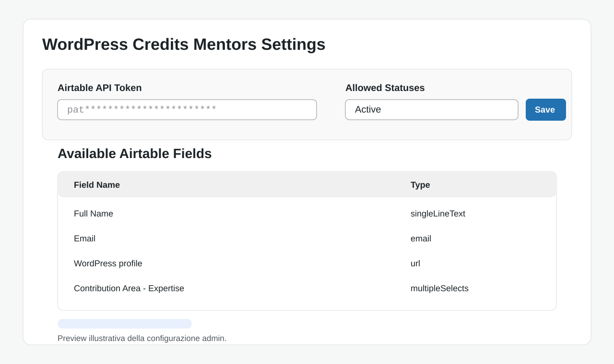
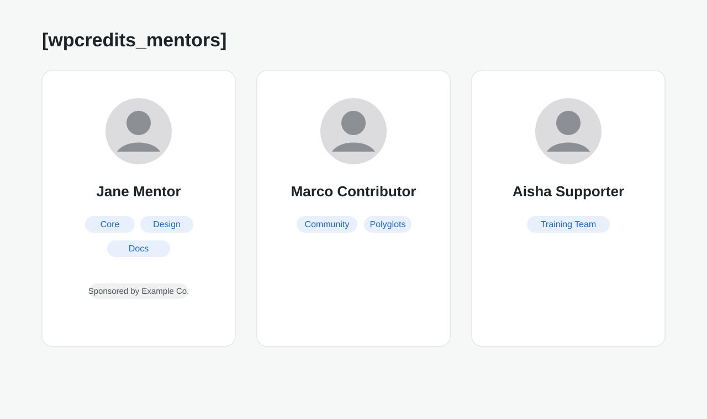
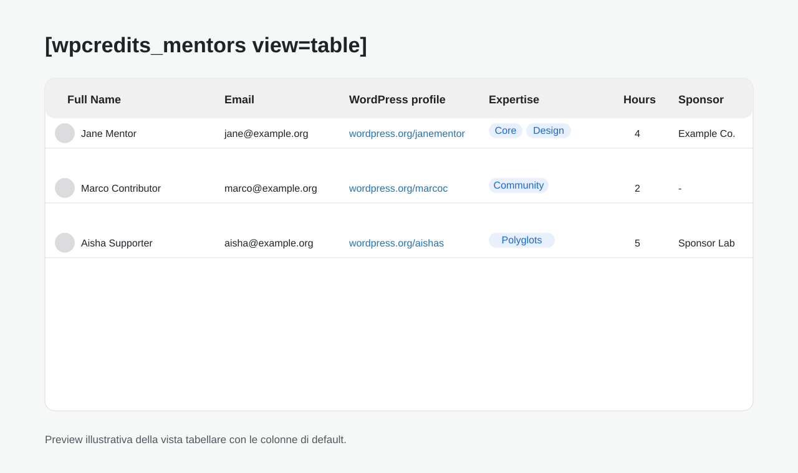

# WordPress Credits Mentors

Plugin WordPress che mostra i mentor del programma WordPress Credits via shortcode. I dati vengono caricati da Airtable.

## Screenshot

Le immagini sotto sono preview illustrative del plugin.

### Admin settings



### Frontend grid view



### Frontend table view



## Requisiti

- WordPress 5.0+
- PHP 7.4+
- Airtable token con accesso lettura alla base
- Permesso Airtable **Meta API / schema** per usare table view e field discovery nell'admin
- Airtable **Base ID** e **Table ID** della tabella mentors da configurare nel backend del plugin

## Installazione

1. Scarica la cartella `wordpress-credits-mentors` in `/wp-content/plugins/`
2. Attiva il plugin da WP Admin
3. Vai in **Impostazioni → Credits Mentors** e configura:
   - **Airtable Base ID** — ID della base Airtable (es. `appXXXXXXXXXXXXXX`)
   - **Airtable Table ID** — ID della tabella Airtable (es. `tblXXXXXXXXXXXXXX`)
   - **Airtable API Token** — Personal Access Token con accesso in lettura alla base e ai metadata/schema Airtable
   - **Allowed Statuses** — Status records da includere (default: `Active`)

Non serve aggiungere nulla a `wp-config.php`: la configurazione Airtable viene salvata nel database tramite il backend del plugin.

Nota sulla cache: i mentors e i field names vengono cacheati per 1 ora, mentre la lista degli statuses disponibili viene cacheata per 1 giorno.

## Shortcode

```
[wpcredits_mentors]
[wpcredits_mentors view=table]
[wpcredits_mentors view=table fields="Full Name,Email,Sponsor company"]
[wpcredits_mentors columns=2]
```

### Parametri

| Parametro | Descrizione | Default |
|-----------|-------------|---------|
| `view`    | `grid` (card) o `table` | `grid` |
| `columns` | Numero colonne nella grid (1-4) | `3` |
| `fields`  | Colonne nella vista table (nomi campi Airtable) | `Full Name, Email, WordPress profile, Contribution Area - Expertise, Available hours per week, Sponsor company` |

Alias backward-compatibili per `fields`: `name`, `email`, `expertise`, `hours`, `sponsor`, `profile`, `status`, `company`.

## Licenza

Questo plugin e' distribuito sotto **GPL-2.0-or-later**.

## Sviluppo

Il plugin è pensato per il progetto [WordPress Credits](https://wordpress.org/credits/) e si integra con il programma di mentoring delle istituzioni partner.
